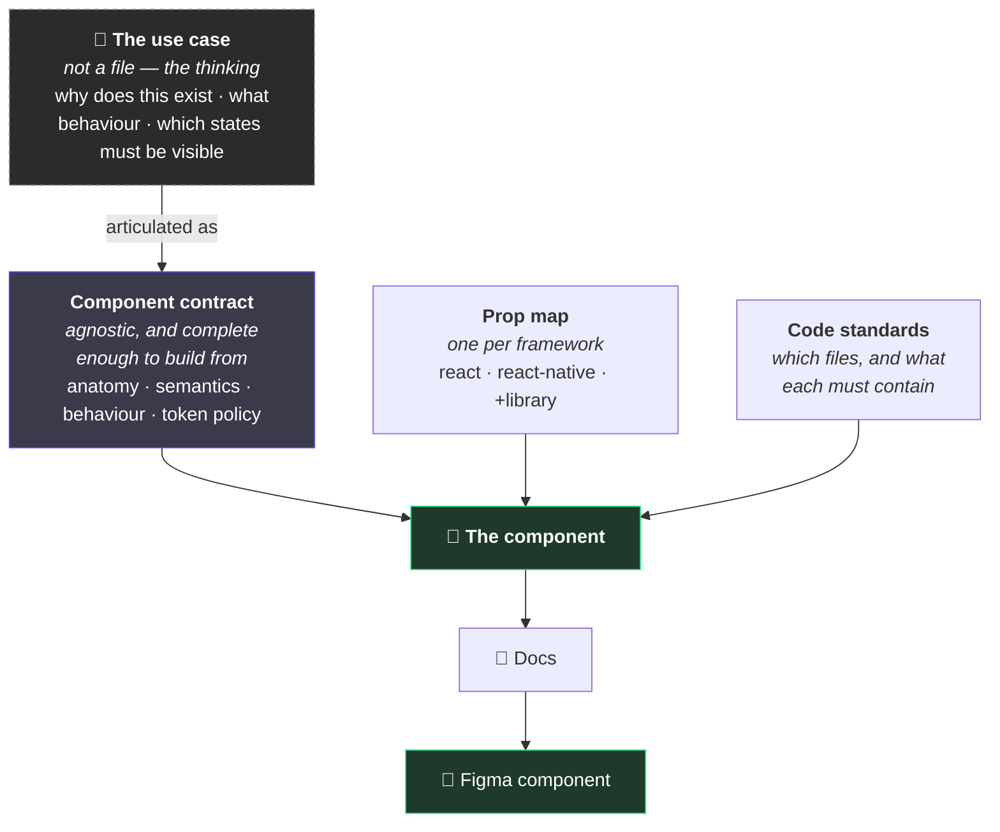
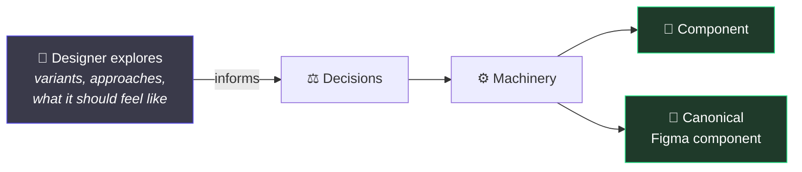

# 1. How this is meant to work

← [Index](./README.md) · Next: [The two halves →](./02-the-two-halves.md)

---

## The one sentence

> **You don't fix the output. You fix the system that produced it.**

Every solved problem compounds instead of evaporating. That is the whole idea; everything below is
machinery for making it true.

## What that means in practice

A button has the wrong padding. Two ways to respond:

|        | What you do                                                           | What you get                                           |
| ------ | --------------------------------------------------------------------- | ------------------------------------------------------ |
| Normal | Edit the button                                                       | A fixed button. The next one has the same bug.         |
| Here   | Fix whatever let the wrong padding through — a token, a rule, a check | Every button, forever, including ones nobody has built |

The second is slower once and free every time after.

## The pipeline

A component is not written. It is **produced** — from a thinking step, then three contracts that
each answer one question:

**The use case is a mental model, not an artifact.** Nobody writes a "use case file". But without
articulating why the component exists, what it must do, and which states have to be visible, there
is nothing to lay the anatomy out _from_ — the contract becomes someone's opinion, well formatted.

**The component contract is framework-agnostic**, and the bar is higher than "describes a
component": it has to carry enough that you could **build** from it. Same contract, React today,
something else later, without re-deciding what the thing _is_.

**The prop map is per framework** — and sometimes per framework _and_ library. React and React
Native need different ones. If the library sits on an unstyled base like Base UI or Radix, that
combination gets its own, because what you inherit changes what you are allowed to author.

**Figma comes last, and only from code.** It cannot be generated before a component exists.

## Figma is an output, not the source

The surprising part: **the canonical component is machine-generated, and so is its Figma version.**

This does **not** mean designers stop working in Figma. Explore freely — that is what Figma is
for, and a decision made without exploring is a guess.

It means the _published_ component in the library is generated from the same contracts the code
comes from. Two artifacts, one source. They cannot drift, because neither is copied from the
other.

Hand-maintaining both is the drift everyone has lived through: the code gains a size, the Figma
library does not, and six months later nobody knows which one is lying.

## Where today's repo actually is

Being straight about this, because a diagram of an intended system reads exactly like a diagram of
a real one:

| Piece              | Today                                                                                                                                                                                  |
| ------------------ | -------------------------------------------------------------------------------------------------------------------------------------------------------------------------------------- |
| Component contract | **Built and framework-agnostic** — schema, gate, composer, with React specifics split into a separate binding file. It specifies rather than describes, so it is enough to build from. |
| Prop map           | **Built**, for one framework, as authored canon vs measured reality. Not yet one per framework.                                                                                        |
| Token policy       | **Built**, and checkable.                                                                                                                                                              |
| Code standards     | **Prose plus a scaffolding skill.** No machine-readable file spec, so nothing validates the shape deterministically.                                                                   |
| The use case       | Nothing prompts for it. The proposal template should, and doesn't.                                                                                                                     |
| Docs → Figma       | **Machinery built, nothing generated.** Three skills can write component sets, pages and diagrams into Figma. They need a component in code first, and there are none.                 |

So: the middle of the pipeline exists and works. The framing at the top and the enforcement at the
bottom are the gaps.

## Why bother with contracts at all

Because the alternative is that all these decisions still get made — just invisibly, by whoever
happens to be typing, and never written down.

Ask a normal design system "why is this a button and not a link", "which token is this background
_supposed_ to be", "is this finished" — and the answer lives in one person's memory. Contracts are
just those answers, written where a machine can check them.

---

Next: [The two halves of a component →](./02-the-two-halves.md)
