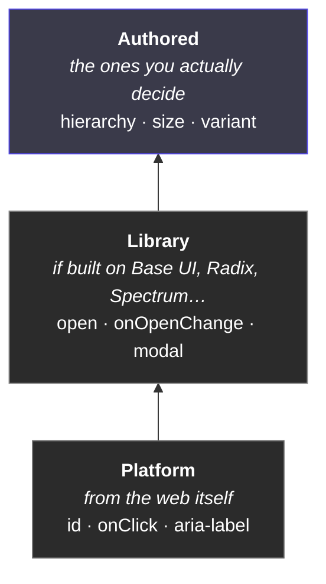
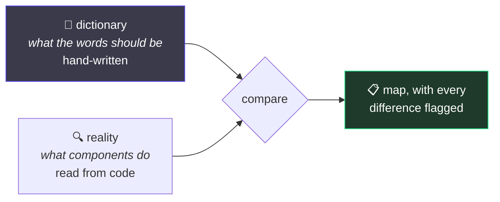

# 5. The shared vocabulary

← [Previous](./04-tokens-and-paint.md) · [Index](./README.md) · Next: [From Figma to a component →](./06-from-figma-to-component.md)

---

## How a system quietly falls apart

> **March.** Someone builds a Button. It needs emphasis levels, so they add `hierarchy` with
> primary / secondary / tertiary. Reviewed. Approved. Sensible.
>
> **June.** Someone else builds a Card. It needs emphasis levels. They haven't read the Button.
> They add `emphasis` with high / medium / low. Reviewed. Approved. Also sensible.

Both reviews were correct. **The problem isn't inside either component** — it only exists in the
space between them, and nobody reviews that.

## Not every prop is yours to decide

This is the part people miss. A component's properties arrive in layers, and you only _author_ the
top one:



Why it matters: **you cannot rename what you inherited, and you must not re-invent it.** If the
platform already gives you `disabled`, adding `isDisabled` means two ways to say one thing. If you
build on an unstyled library that already exposes `open` / `onOpenChange`, inventing `isVisible`
puts you permanently out of step with every other consumer of that library.

So the useful question when naming is not _"what should this be called?"_ but _"do I already have
one, and where did it come from?"_

Which means **there is no single prop map.** React and React Native inherit different things, so
they get different maps. Add an unstyled base library and that combination gets its own, because
what you inherit changes what you are free to author.

> **Today's repo has one map, showing the authored layer only** — it filters the inherited props
> out to keep the list readable. One map per supported framework, with the inherited surface
> visible, is known work that hasn't been done.

## The dictionary



Comparing the two is the only place a synonym is visible. `pnpm prop-map`.

| Property      | Means                                 | Values                                         |
| ------------- | ------------------------------------- | ---------------------------------------------- |
| `size`        | one shared scale                      | `xs` `s` `m` `l` `xl`                          |
| `hierarchy`   | how much emphasis an action carries   | `primary` `secondary` `tertiary`               |
| `variant`     | what it means, which picks the colour | `neutral` `brand` `success` `warning` `danger` |
| `orientation` | which way it flows                    | `horizontal` `vertical`                        |
| `placement`   | where it sits relative to its anchor  | a set per situation                            |

Plus an anti-synonym list, which does the real work:

> `danger` — never `error`, `critical` or `red`
> `m` — never `medium` or `md`
> `neutral` — never `default` or `base`

Naming the word _and_ the words it isn't. "Use `danger`" doesn't stop anyone reaching for `error` —
they never saw the rule. "Never `error`" does, because it answers the question they were about to
ask.

## When someone diverges

```
`size` (Button) — "large" is not canonical (xs | s | m | l | xl) · **unreviewed**
```

`unreviewed` is the point. A difference isn't automatically wrong — sometimes the dictionary is
what should change. But it can't pass _unnoticed_. It sits there labelled until someone records
`fix`, `review`, `accepted` or `legacy`, always with a reason.

And a note about a component that no longer exists **fails** the build, so the list can't rot into
excuses for problems solved years ago.

## Two rules you'll feel

**`variant` and `hierarchy` are different questions.**

|             | Asks               | Values                                   |
| ----------- | ------------------ | ---------------------------------------- |
| `hierarchy` | how loud is this?  | primary, secondary, tertiary             |
| `variant`   | what does it mean? | neutral, brand, success, warning, danger |

A destructive action that is also the main action is `variant="danger"` **and**
`hierarchy="primary"`. Two dials. Merge them and you get `primary` / `secondary` / `danger` /
`danger-secondary`, growing by multiplication forever. In Figma: two variant properties, not one.

**The scale is the scale.** A component may expose a subset of `xs`–`xl`, but may not invent `sm`
or `compact` or add `xxl` because one screen needed it. If a step is genuinely missing, that's a
change to the scale — once, for everyone.

## Why it flags rather than blocks

**A naming choice is a judgement call, and a tool can't make it.** `emphasis` might genuinely be
the better word. What a tool _can_ do is make sure nobody picks it alone, by accident, without
knowing the other word existed.

The one thing enforced: the map must be current and every difference labelled. You may disagree
with the dictionary. You may not quietly ignore it.

---

Next: [From Figma to a component →](./06-from-figma-to-component.md)
