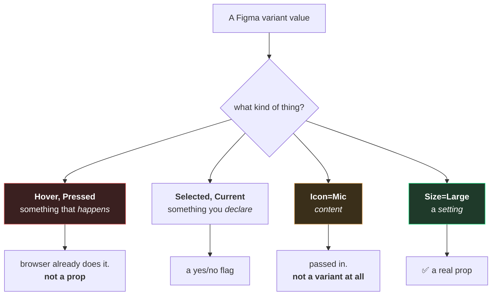
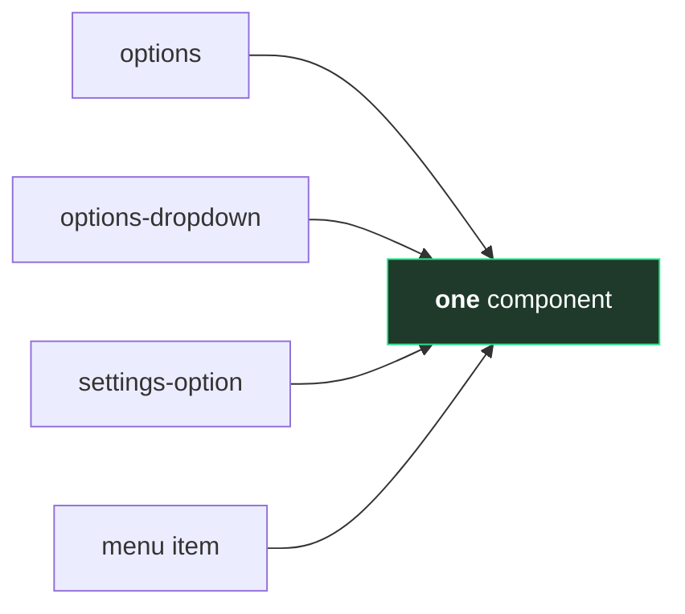
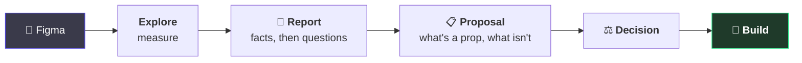

# 6. From Figma to a component

← [Previous](./05-the-shared-vocabulary.md) · [Index](./README.md)

---

## Why your variants don't survive the trip

You hand over five variant properties. Three come back as props. Nothing was lost — two of them
were never props.

**Figma has exactly one mechanism** for "this looks different sometimes", so everything becomes a
variant: settings, moments, and content alike. Code has three, and picking the wrong one causes
real problems.

**Hover is the big one.** In Figma you have to draw it — there's nowhere else to put it, and the
builder needs to see it. In code it already works, for free.

So the Hover variant isn't discarded. It's used, as the picture of what hover should look like. It
just becomes a hover rule instead of a property. [Page 3](./03-anatomy-and-parts.md) covers why
making it a property actively breaks things.

**Content isn't a variant either.** `Icon=Mic` / `Icon=Camera` / `Icon=Screen` is not three states
of one thing — it's one thing with a hole an icon goes into. Multiplying content into variants is
how a set reaches 300 of them.

## The trap that costs most

From the file this template was built for — four separate components that are the same 52px row
with an icon, a label and a trailing affordance:

They were drawn separately because they appear in four places — a completely reasonable way to lay
out screens. Built as four components, it's four sets of styles and four things to update forever,
and they will drift.

**Spotting this is the point of exploring before building.** It's only visible when someone looks
at the whole file at once and asks "are any of these the same thing?" — which is not a question you
can answer while designing one screen.

The reverse trap is in the same file: "Button" covers a labelled button, an icon-only toggle, and a
control with a live audio waveform in it. One name, three components.

## The process

**The proposal is where you want to be involved.** A short document, written before any code, that
says what this component set contains, which parts are actually settings, and what we're
deliberately not building. Arguing there costs nothing; arguing after costs a rewrite.

Two rules it runs on:

- **Measured and inferred stay separate.** "Four spacing steps: 0, 2, 8, 16" is a measurement. "The
  gaps suggest two unused rungs" is a reading. Mix them and someone later quotes the guess as fact.
- **A gap is a finding, not a blank to fill.** If something can't be determined it's recorded as
  undetermined. A confident guess never gets revisited; a recorded question does.

## The section that matters most

Every proposal ends with **what we deliberately did not build**, and why. It looks like
bureaucracy. It's the most re-read part.

> The design has four audience colours. Those are a theme applied to an area, not a property on
> this component. If audiences need different palettes, that's set once at the top and this
> component stays unaware.

Without it, someone adds an `audience` prop in four months — not carelessly, but by looking at the
same design and reaching the same first conclusion, before thinking it through. **That paragraph
has the argument on your behalf when you're not in the room.**

## What we'll ask you

| We'll ask                               | Because                                                       |
| --------------------------------------- | ------------------------------------------------------------- |
| Are these genuinely the same component? | four near-identical rows is four times the maintenance        |
| Is this a setting, or a moment?         | settings become props, moments become states                  |
| Which differences actually matter?      | every variant is a permanent commitment                       |
| What should it be called?               | [page 5](./05-the-shared-vocabulary.md) — the word is the API |
| What are we _not_ building?             | the paragraph that stops it being re-added                    |

None of these need you to read code. All are much cheaper before it exists.

---

[← Back to the index](./README.md)
